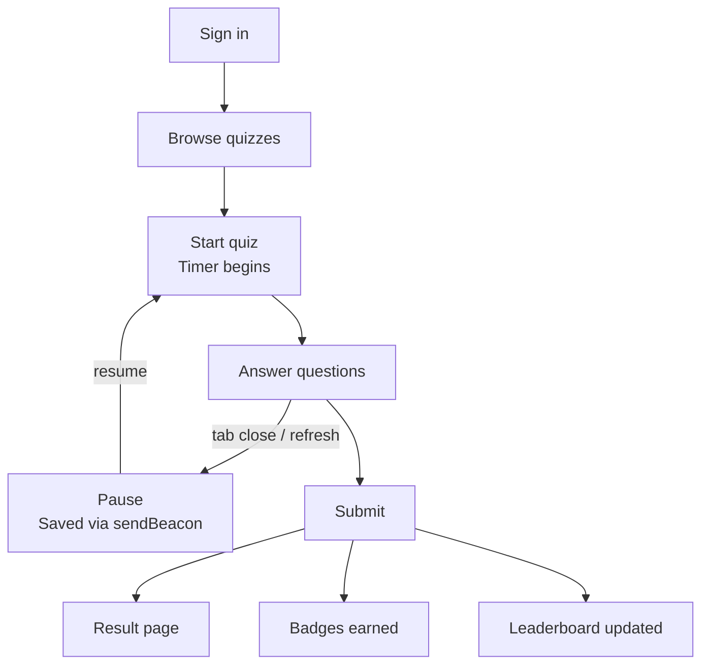
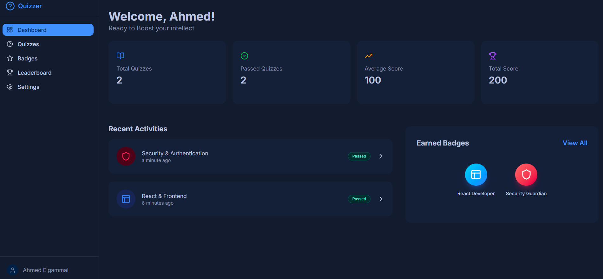
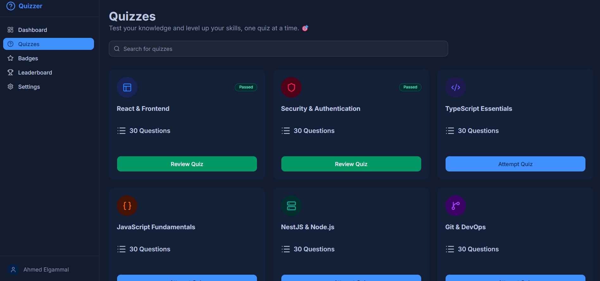
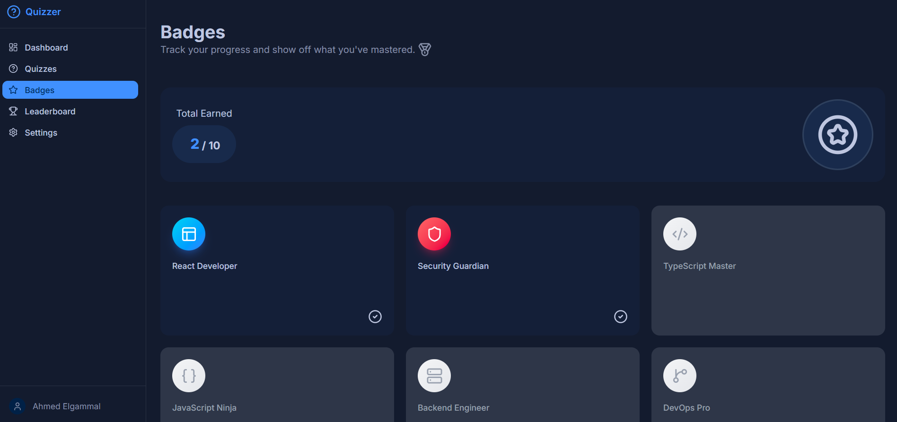
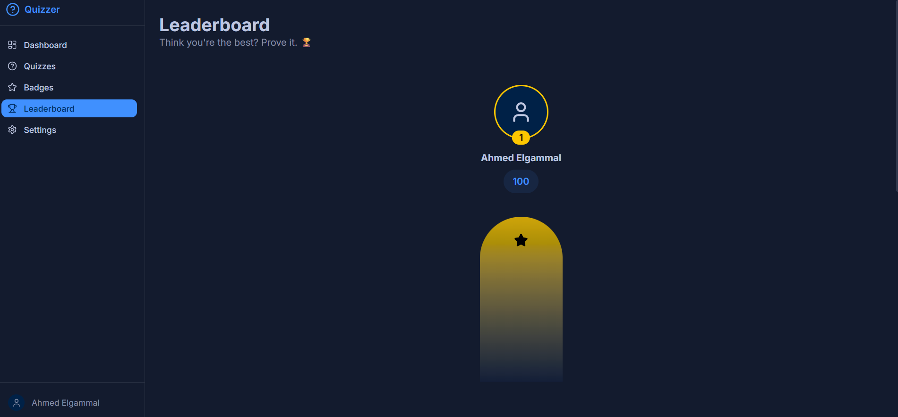
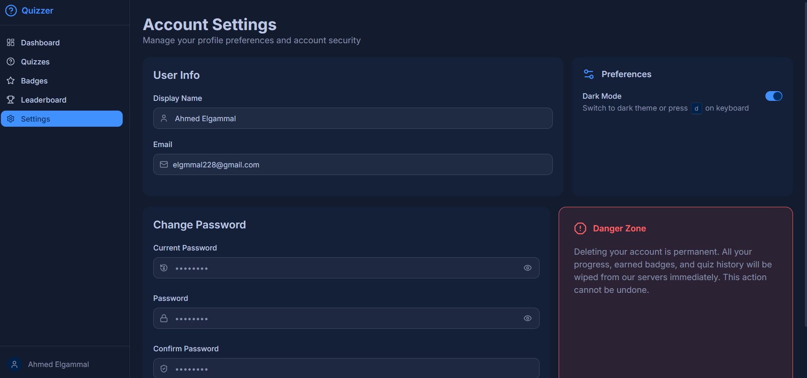

<h1 align="center" style="padding: 20px 0">🧠 Quizzer — FrontEnd 📊</h1>

> A full-featured quiz platform built with Next.js — take timed multiple-choice quizzes, earn badges, track your progress, and compete on the leaderboard.


## ✨ Features

- **Timed Quizzes** — each quiz runs against a countdown timer
- **Pause & Resume** — leave mid-quiz and pick up exactly where you left off
- **Multiple Choice** — clean, keyboard-friendly answer selection
- **Result Tracking** — every attempt is saved with score and time taken
- **Badges** — earn achievements based on performance and streaks
- **Leaderboard** — global rankings updated in real time
- **Auth** — sign in with Google (OAuth) or email/password (JWT)

## 🛠️ Key Features

- **Responsive Design** — smooth experience across all devices, from desktop to mobile
- **Dark Mode** — built-in theme switching
- **Form Validation** — using React Hook Form and Zod
- **Safe User Progress** — never lose progress with our automatic saving mechanism
- **Atomic Design** — component architecture for easy reuse across the project
- **Data Efficiency** — pagination applied throughout for optimal performance

## ⚡ Technical Highlights

- Optimized quiz behavior across different statuses
- Improved data efficiency and memory usage with pagination
- Ensured correct data flow from server to components
- Achieved high performance with SSR rendering
- Synced user progress with the database
- Built a scalable configuration system for easy reuse across the app
- Enforced data type validation with Zod
- Improve UX by implementing skeleton loaders while data is fetching

## 💡 What I Learned

- Differentiating between client and server components in Next.js
- Unlocking the performance advantages of SSR in frontend apps
- How OAuth integration works in frontend applications
- How to preserve user data when the tab is closed or refreshed
- System security and how to handle it with JWT and cookies
- How to build a reliable, scalable system for users

## 🔄 Quiz Flow



## 🔌 API Integration

The Project use REST-API built with Nest JS [Back-End Repo](https://github.com/Ahmed-Elgammal-900/Quiz-App-Back-End)

## 🚀 Getting Started

### Prerequisites

- Node.js 18+
- pnpm (or npm/yarn)

### Installation

```bash
git clone https://github.com/Ahmed-Elgammal-900/Quiz-App-Front-End.git
cd Quiz-App-Front-End
pnpm install
```

### Environment Variables

```bash
touch .env.local
```

| Variable              | Description                 |
| --------------------- | --------------------------- |
| `NEXT_PUBLIC_API_URL` | Backend API base URL        |
| `PARAM_SECRET`        | Secret for property signing |

### Run Locally

```bash
pnpm dev
```

---

## 📸 Screenshots

### Dashboard



### Quizzes



### Badges



### Leaderboard



### Settings

## 

## ⚙️ CI/CD

Automated pipeline configured with **GitHub Actions**

---

## 📁 Project Structure

```text
.
├── actions                           # Server actions (auth, quiz, user)
├── app                               # Next.js App Router
│   ├── (auth)                        # Auth pages (login, register)
│   ├── api                           # API route handlers
│   ├── dashboard                     # Dashboard pages
│   ├── quiz                          # Quiz taking experience
│   └── result                        # Result pages
│
├── components
│   ├── ui                            # Feature-based UI components
│   │   ├── auth
│   │   ├── badges
│   │   ├── dashboard
│   │   ├── leaderboard
│   │   ├── quiz
│   │   ├── quizzes
│   │   ├── result
│   │   ├── settings
│   │   └── system                    # Shared system components
│   └── theme-provider.tsx
│
├── config                            # App-wide configuration (nav, badges, quiz status)
│
├── constants                         # Static constants
│
├── context                           # React context providers
│
├── hooks                             # Custom React hooks
│
├── lib
│   ├── server                        # Server-only utilities (status and time signing)
│   └── utils.ts                      # Shared utilities
│
├── public
│   └── sounds                        # Audio assets
│
├── services                          # API call layer (auth, dashboard, leaderboard)
│
├── styles                            # Global CSS
│
├── types                             # TypeScript type definitions
│
├── utils                             # Client utilities (cookies, field generators)
│
└── validations                       # Zod schemas (auth, quiz, leaderboard)
```

## 📦 Scripts

| Command          | Description              |
| ---------------- | ------------------------ |
| `pnpm dev`       | Start development server |
| `pnpm build`     | Production build         |
| `pnpm start`     | Start production server  |
| `pnpm lint`      | Run ESLint               |
| `pnpm typecheck` | Run TypeScript check     |

---

## 📄 License

MIT License

---

<div align="center">
  Built with ❤️ by <a href="https://github.com/Ahmed-Elgammal-900">Ahmed Elgammal</a>
</div>
